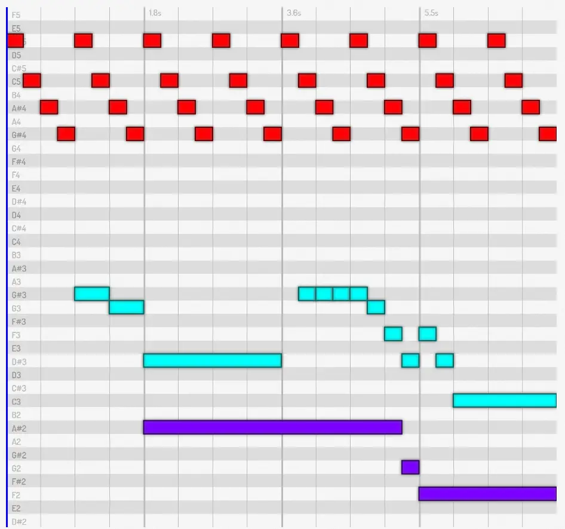
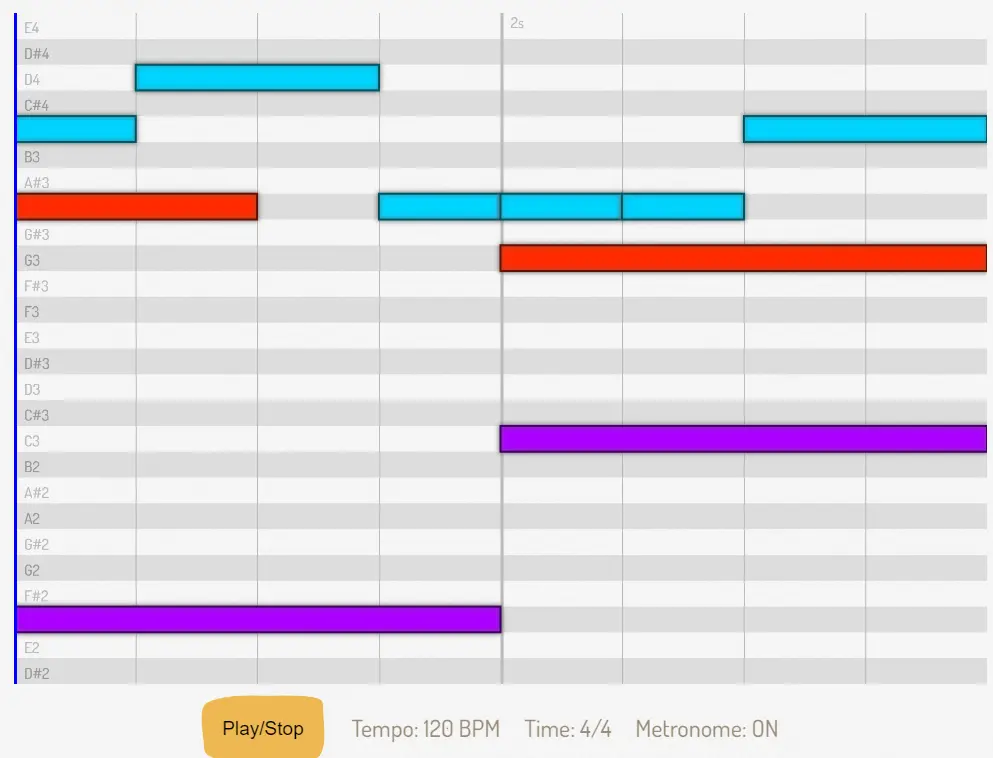

I made a thing again! Something I couldn't find anywhere else on the internet, but which proved to be immensely useful. It's called "PQ_MIDI" ( = Pandaqi Midi).

It's an **audio visualizer and player** using vanilla JavaScript, specifically made for usage in a Hugo website. 

It's not a _true_ MIDI player. The input is a piece of text with a simple syntax. I needed a simple tool that was both songwriting, audio and visualization (that wasn't sheet music) in one. I called it PQ_MIDI because it's the closest thing to it.

If you have some coding knowledge, you can modify it to work anywhere. (A Hugo "shortcode" is just a fixed piece of HTML that's printed to a page, which you can hand arguments. Any other website system probably has a similar functionality.)

Like all the custom tools I build, it was written hastily and to do _one_ thing very well. Use it at your own risk.

What does it do?

* Use the `midi` shortcode on any Hugo page
* Between the tags, add your melody using some simple syntax
* The library converts this into playable audio
* And a visual that shows the notes as they're being played.

You can find it on GitHub: \<@TODO: Link \> 

This is what it looks like.

## Why?

I needed it for my [Pandaqi Tutorials](https://pandaqi.com/tutorials) website. There are some courses about audio and songwriting, which begged for audiovisual examples everywhere.

You can see it in action throughout this course: [Songwriting](https://pandaqi.com/tutorials/audio/songwriting)

## Usage

Download the JavaScript file and the folder with sound files.

* Place the code somewhere in your `assets` folder. Then include it on all your pages. 
* Place the sound in your `static` folder (or wherever you can easily reference/access it).

You're done. It automatically detects the midi blocks and does its magic.

## How?

The Hugo shortcode prints a piece of HTML to the page

* A hidden element that holds the syntax for your melody
* A Canvas element (which will draw the melody)
* A button (for play/stop) and some metadata (like tempo)

The JavaScript finds all these elements and converts them into usable objects. It parses the melody. The Canvas displays it and the button will play it. When played, it loads audio files from a folder, buffers them, and then simply ... plays them at the right time.

The sounds are exported from my DAW using the _Salamander Piano_ VST, with some light editing to make it less harsh (when played this way). They are in `.ogg` format and as small as possible. All notes from **C2** up to and including **C6** are available.

All this makes the library _superduper fast_, which was one of my goals.

## Future

Adding interactivity is on my wishlist. (Allowing my readers to create, move, edit the notes instead of just playing them.) Otherwise, it's completely done and I don't see what else I could add.

## Shortcode

### Parameters

It can take these parameters. All of these are optional

* `tempo` (number; 120): tempo of the sample in BPM
* `strict` (boolean; false): if true, requires some things about your syntax. (Measures need to be correct and tracks must be the same length.)
* `time` (number/number; 4/4): time signature of the sample
* `caption` (text): a caption displayed with the sample
* `transpose` (number; 0): transposes the whole sample
* `metronome` (boolean; false): if true, adds a a click track 
* `pitch_input` (absolute or relative): how you input your pitches
* `time_input` (absolute, relative or tradition): how you input your note duration

### Example

Here's an example of using the shortcode in a Hugo file.


  
  ... your melody here ...
  


## Syntax

How to enter your music?

### Tracks

Start each **track** on a new line and with `:`. A track is one continuous _sequence_ of notes. (So if you want multiple notes a at the same time, use multiple tracks. You can have an infinite number of them.)

### Notes

A track contains **notes** with spaces between them. Optionally, you can add bars (`|`) to indicate where new measures should start. This is ignored, but helps keep your syntax clean and correct.

Every note has the syntax: `PITCH/TIME/VOLUME`. 

The slash between _pitch_ and _time_ always has to exist. The one between _time_ and _volume_ does not. Rests are notated using the `R` pitch, whatever the other settings are.

### Pitch

**Pitch** can be given in two ways.

* Absolute: written as _note_ + _octave_. So, C3, or E4, or F2, ...
* Relative: written relative to the previous note. (First note must be absolute to set a starting point.)

If left out, this note _extends_ the previous note. (It doesn't create a new note, but adds its time and volume to the previous.) 

_Relative input?_ Use `^X` to make the note X higher than the previous. Use `_X` to make the note X lower than the previous. Never ended up using it myself, but it works.

### Time

**Time** can be given in three ways.

* Absolute: written as a _number_ of beats
* Relative: written relative to the previous note. (First note must be absolute to set a starting point.)
* Traditional: written like sheet music. A 2 is a half note, a 4 is a quarter note, an 8 is an eight note. Add a dot to the end for dotted notes.

If left out, the note defaults to a single beat.

The default is absolute. This is unconventional---you might like "traditional" better in many cases.

### Volume

**Volume** goes from 0 to 100. Can be omitted entirely (including the slash), which defaults to 100. If slash is added, but no number, it uses the same volume as the previous note.

### Example

Here's an example of syntax and the result


:C4/1 D4/2 A3/1 | A3/1 A3/1 C4/2 |
:F2/4 | C3/4 |
:A3/2 R/2 | G3/4 |


## Configuration

You can change how it looks through a config. Before loading the library, define the global variable `PQ_MIDI` and assign the variable `config`.

These properties can be set:

* `font` (object):
  * `light` (string; #BBB): color of the lighter text
  * `dark` (string; #999): color of the darker text
  * `size` (number; 30): size of text
  * `family` (string; Dosis): font used
* `pitch` (object): 
  * `barLight` (string; white): color of the lighter horizontal bars
  * `barDark` (string; #DDD): color of the darker horizontal bars
  * `emptyPitchesAround` (number; 2): space above and below sample where nothing is drawn
  * `textMargin` (number; 20): margin to offset pitch text
  * `shadowSize` (number; 10): shadow blur to make notes pop out
  * `shadowColor` (string; #666): color of that shadow
  * `verticalScale` (number; 1): scales the height of the canvas (and thus pitches) by this factor
* `time` (object):
  * `lineWidth` (number; 6): thickness of lines where new measure starts
  * `textMargin` (number; 20): margin to offset time text  
  * `cursorColor` (string; #0000FF): color used for the time cursor (that scrolls when playing)
  * `cursorWidth` (number; 6): width of time cursor line

Dosis is the main font for my Pandaqi brand, that's why.

This config can also change some more general properties.

* `audio` (object):
  * `path` (string): path to where your audio files are saved (if you want to use a custom structure)
  * `metronomeVolume` (number): 0 to 100, how loud the metronome clicks should be


window.PQ_MIDI = {};
PQ_MIDI.config = {
    font: { family: "Arial" },
    pitch: { emptyPitchesAround: 0 }
}
